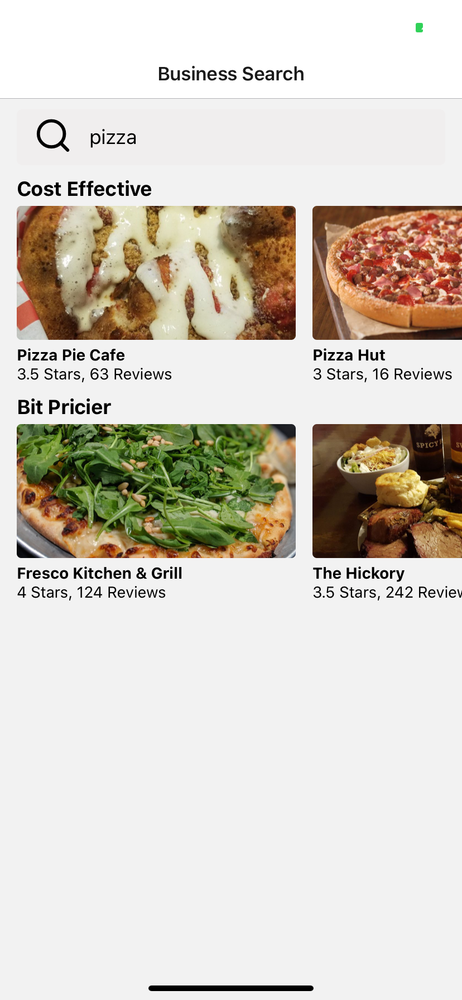

# food
React Native Yelp API
## Summary
React Native Yelp API to find local resturants in you area and break down searchs by 

## Usage

When you open the application you will start on the landing page below:

Search in the top searchBar for a food cadigory to see local food options!

## Architecture 

A fun app that uses React Native alone with a Yelp API

## About

Single page App to find local food options and catigorize based into proce range.

## Running locally
Steps to run:
- download the Expo app on your mobile device
- npm install
- npm start
- A web browser will open in which you can then scan the code that pops up with your phones camra.

